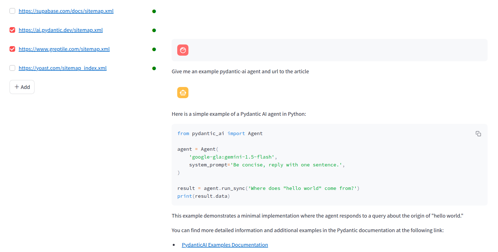

# Chat with sites



## Requirements
- Create a project at supabase, acquire url and api_key
- OpenAI API KEY
- Put secrets in `.env` (see `.env.example`)

## Usage

Start the container:

```bash
docker compose up --build -d
````

### Database Setup

Execute the SQL commands in `site_pages.sql` to:
1. Create the necessary tables
2. Enable vector similarity search
3. Set up Row Level Security policies

In Supabase, do this by going to the "SQL Editor" tab and pasting in the SQL into the editor there. Then click "Run".

### Streamlit Web Interface

For an interactive web interface to query the documentation:

```bash
docker exec -it crawl4ai-python_env-1 sh -c "streamlit run streamlit_ui.py"
```

**Notes:** I met RLS-related errror when trying to insert rows, so I simply went to `supabase.com/dashboard/project/yourprojid/auth/policies` to disable RLS. After the ingesting is complete, I turn it back on. It's lame but I cannot be bothered soon.

## Functionalities:

- UI for ingesting from sitemap.xml urls
- UI for chat
- Select/Deselect multi sources to chat with

Status color:
- green: ready
- blue: ingesting

A sitemap.xml URL is the location of a special XML file on a website that provides search engines like Google, Bing, and others with a structured list of the important pages on the site. It helps search engines understand the site's content and efficiently crawl and index its pages.

In this application, you provide the sitemap.xml URL, and it crawls from urls listed under that xml.

## Disclaimer

Not all sites contains valid sitemap.xml URL. Fortunately, popular documentation sites usually do. For example:
- https://ai.pydantic.dev/sitemap.xml
- https://langchain-ai.github.io/langgraph/sitemap.xml
- https://docs.crawl4ai.com/sitemap.xml

Most code is copied from [Cole's](https://github.com/coleam00/ottomator-agents/blob/main/crawl4AI-agent/README.md), with some changes. 
Also check out his [Youtube channel](https://www.youtube.com/@ColeMedin)

I do not support unethical crawling. This repo is for education only.


## Next plan:
Scope of search:
- Allow selecting github repos to chat with as well

Search and generate config:
- Allow setting common search and text generation config (models, max_tokens, temperature, top_k, etc)

Agentic RAG:
- More complexities: decomposition, delegation, looping
- Tools

